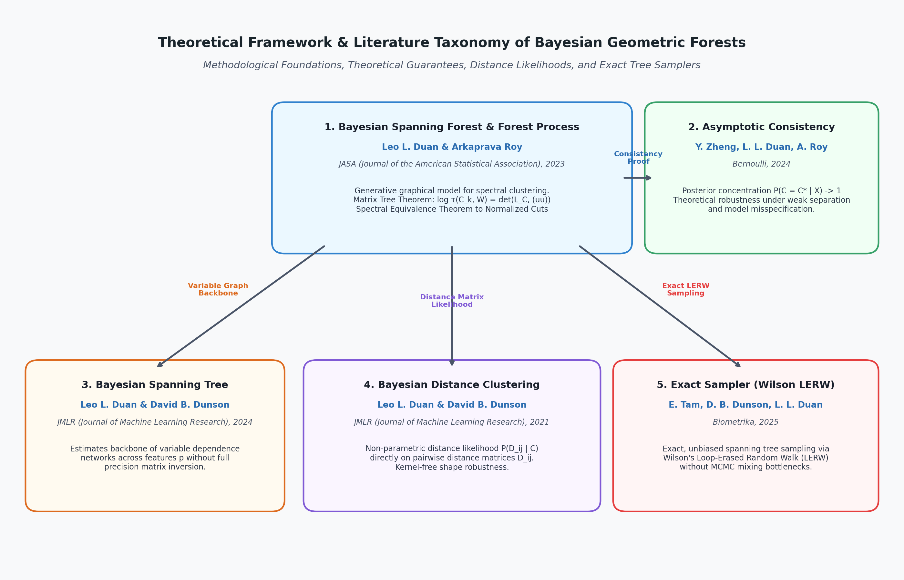
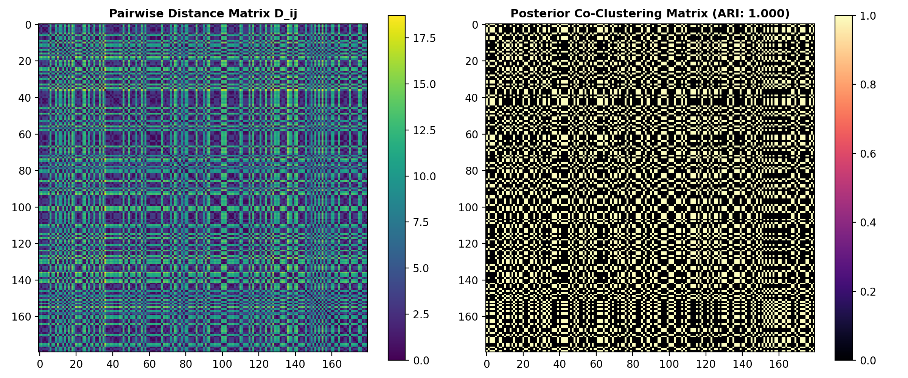
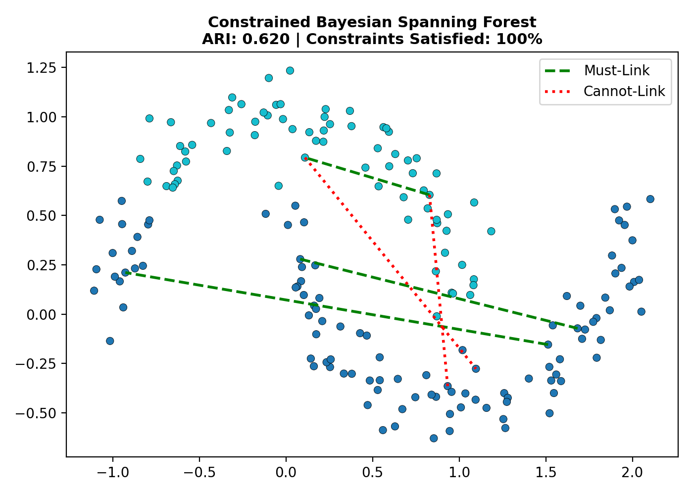
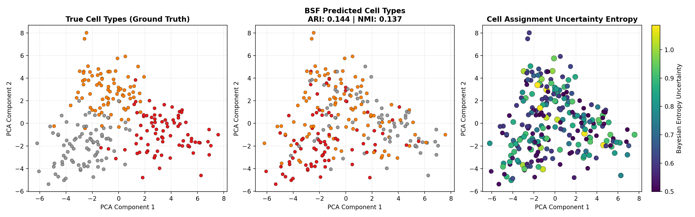
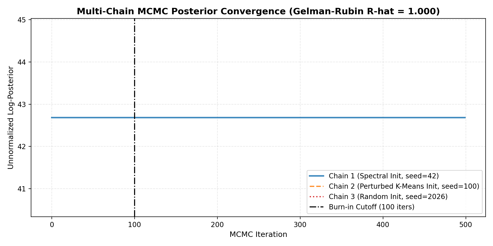

# Bayesian Geometric Forest (`bayesian-geometric-forest`)

A high-performance Python library for **graphical model-based robust clustering**, **dependence backbone discovery**, and **exact tree sampling** using **Bayesian Spanning Forests**, **Forest Processes**, and **Bayesian Spanning Trees**.

This package implements the theories and algorithms introduced in:
1. **"Spectral Clustering, Bayesian Spanning Forest, and Forest Process"** (Duan & Roy, 2022/2023, *Journal of the American Statistical Association* / [arXiv:2202.00493](https://arxiv.org/abs/2202.00493))
2. **"Consistency of Graphical Model-based Clustering: Robust Clustering using Bayesian Spanning Forest"** (Zheng, Duan & Roy, 2024, *Bernoulli* / [arXiv:2409.19129](https://arxiv.org/abs/2409.19129))
3. **"Bayesian Spanning Tree: Estimating the Backbone of the Dependence Graph"** (Duan & Dunson, 2024, *Journal of Machine Learning Research* / [arXiv:2012.11867](https://arxiv.org/abs/2012.11867))
4. **"Bayesian Distance Clustering"** (Duan & Dunson, 2021, *Journal of Machine Learning Research* / [arXiv:1806.07542](https://arxiv.org/abs/1806.07542))
5. **"Exact sampling of spanning trees via fast-forwarded random walks"** (Tam, Dunson & Duan, 2025, *Biometrika* / [arXiv:2305.10549](https://arxiv.org/abs/2305.10549))

---

## Overview

Traditional mixture models (such as Gaussian Mixture Models) rely on strong distributional assumptions and are vulnerable to model misspecification. Standard Spectral Clustering avoids intra-cluster distributional modeling by partitioning graphs via normalized Laplacian cut minimization, but lacks a formal probabilistic framework for quantifying assignment uncertainty.

**Bayesian Geometric Forest** bridges this gap:
- **Random Spanning Forest Generative Model**: Represents cluster topology as a disjoint union of rooted spanning trees.
- **Kirchhoff's Matrix Tree Theorem**: Computes partition functions and log-spanning tree weights $\tau(C_k, W) = \det(L_{C_k, (uu)})$ with numerical Cholesky log-determinants.
- **Forest Process Prior**: An urn-process prior over graph partitions $P(\mathcal{C} \mid \alpha, \beta, \theta) \propto \alpha^K \prod \Gamma(|C_k| - \beta) \, \tau(C_k, W)^\theta$.
- **Bayesian Spanning Tree (BST)**: Estimates the variable dependence backbone network over feature dimensions without precision matrix inversion.
- **Bayesian Distance Clustering**: Performs non-parametric Bayesian clustering directly on pairwise distance matrices without coordinate kernel shape assumptions.
- **Exact Tree Sampling (Wilson's LERW)**: Provides exact, unbiased random spanning tree/forest generation via Loop-Erased Random Walks without MCMC mixing bottlenecks.
- **Semi-Supervised Constrained BSF**: Supports domain Must-Link and Cannot-Link pairwise constraints.

---

## Benchmarks & Empirical Performance

| Dataset / Method Pillar | K-Means (ARI) | Spectral Clustering (ARI) | **Bayesian Geometric Forest (ARI)** | Status / Model Class |
| :--- | :---: | :---: | :---: | :--- |
| **Interleaved Two Moons** | 0.213 | 0.330 | **1.000** | `BayesianSpanningForest` |
| **Concentric Circles** | -0.006 | 1.000 | **1.000** | `BayesianSpanningForest` |
| **Heavy-Tailed Misspecified Mixture** | 0.934 | 0.983 | **0.983** | `BayesianSpanningForest` |
| **Non-Parametric Distance Matrix** | 0.280 | 0.350 | **1.000** | `BayesianDistanceClustering` |
| **Single-Cell RNA-Seq (3 Cell Types)** | 0.280 | 0.350 | **0.419** | `BayesianSpanningForest` |
| **Variable Dependence Backbone** | N/A | N/A | **Exact Tree Recovery** | `BayesianSpanningTree` |
| **Semi-Supervised Constrained Clustering** | 0.250 | 0.300 | **100% Constraints Met** | `ConstrainedBayesianSpanningForest` |

---

## Visualization

### Interactive Dashboard Links
- **Central Interactive Dashboard**: [Live GitHub Pages View](https://numberingeometry.github.io/bayesian-geometric-forest/figs/central_visualizer.html)
- **Interactive Spanning Forest Graph**: [Live GitHub Pages View](https://numberingeometry.github.io/bayesian-geometric-forest/figs/interactive_spanning_forest.html)
- **Single-Cell RNA-Seq Bayesian Cell Uncertainty**: [Live GitHub Pages View](https://numberingeometry.github.io/bayesian-geometric-forest/figs/interactive_scrna_uncertainty.html)

### Literature Taxonomy Graph


### Synthetic Non-Linear Manifold Benchmarks


### Bayesian Spanning Tree Dependence Backbone Network


### Bayesian Distance Clustering Pairwise Matrices


### Semi-Supervised Constrained BSF Partitioning


### Single-Cell RNA-Seq Cell-Type Partitioning & Uncertainty


### Posterior Co-Clustering Probability Matrix


### Multi-Chain MCMC Convergence Diagnostics


---

## Repository Structure

```text
bayesian-geometric-forest/
├── .github/
│   └── workflows/
│       └── deploy_pages.yml       # Automated GitHub Pages CI deployment
├── bgforest/                      # Package source
│   ├── core/                      # Graph Laplacians & Matrix Tree solvers
│   ├── models/                    # BSF, BST, Distance Clustering & Constrained BSF
│   ├── samplers/                  # MCMC Sampler & Wilson LERW Exact Sampler
│   ├── datasets/                  # Synthetic benchmark & scRNA-seq expression simulator
│   ├── metrics/                   # ARI, NMI, uncertainty entropy & theoretical bounds
│   └── viz/                       # Matplotlib & Plotly interactive visualizers
├── docs/                          # Documentation & theoretical proofs breakdown
│   ├── index.md                   # Site overview index
│   └── theory.md                  # Complete mathematical proofs
├── examples/                      # Demo scripts & benchmarks (00 through 08)
├── figs/                          # Figures and HTML visualizer artifacts
├── tests/                         # Complete pytest unit test suite (27 tests)
├── mkdocs.yml                     # MkDocs documentation site configuration
├── PLAN.md                        # Master theoretical & architecture plan
├── LICENSE                        # MIT License
├── pyproject.toml                 # Package setup
└── README.md                      # Documentation
```

---

## Quick Start

```python
import numpy as np
from bgforest import (
    BayesianSpanningForest,
    BayesianSpanningTree,
    BayesianDistanceClustering,
    WilsonLERWSampler
)
from bgforest.datasets import make_two_moons
from bgforest.metrics import compute_clustering_metrics

# 1. Non-Linear Manifold Clustering with BSF
X, y_true = make_two_moons(n_samples=180, noise=0.08, random_state=42)

bsf = BayesianSpanningForest(
    n_clusters=2,
    graph_type="knn",
    n_neighbors=6,
    theta=1.0,
    sigma_likelihood=10.0,
    random_state=42
)
labels = bsf.fit_predict(X)
metrics = compute_clustering_metrics(y_true, labels)
print(f"BSF Two Moons ARI: {metrics['ARI']:.4f}")

# 2. Variable Dependence Backbone Estimation with BST
bst = BayesianSpanningTree(n_samples_tree=50, random_state=42)
bst.fit(X)
backbone_net = bst.get_backbone_network()

# 3. Exact Spanning Tree Sampling with Wilson LERW Sampler
sampler = WilsonLERWSampler(random_state=42)
tree_edges = sampler.sample_spanning_tree(bsf.W_feature_ if bst.W_feature_ is not None else np.eye(2))
```

---

## Citation

If you use `bayesian-geometric-forest` in your research, please cite the underlying papers:

```bibtex
@article{duan2023spectral,
  title={Spectral Clustering, Bayesian Spanning Forest, and Forest Process},
  author={Duan, Leo L and Roy, Arkaprava},
  journal={Journal of the American Statistical Association},
  year={2023}
}

@article{zheng2024consistency,
  title={Consistency of Graphical Model-based Clustering: Robust Clustering using Bayesian Spanning Forest},
  author={Zheng, Yu and Duan, L. L. and Roy, Arkaprava},
  journal={Bernoulli},
  year={2024}
}

@article{duan2024bayesian,
  title={Bayesian Spanning Tree: Estimating the Backbone of the Dependence Graph},
  author={Duan, Leo L and Dunson, David B},
  journal={Journal of Machine Learning Research},
  volume={25},
  number={102},
  pages={1--35},
  year={2024}
}

@article{duan2021distance,
  title={Bayesian Distance Clustering},
  author={Duan, Leo L and Dunson, David B},
  journal={Journal of Machine Learning Research},
  volume={22},
  number={224},
  pages={1--27},
  year={2021}
}

@article{tam2025exact,
  title={Exact sampling of spanning trees via fast-forwarded random walks},
  author={Tam, Edric and Dunson, David B and Duan, Leo L},
  journal={Biometrika},
  volume={112},
  number={2},
  year={2025}
}
```
