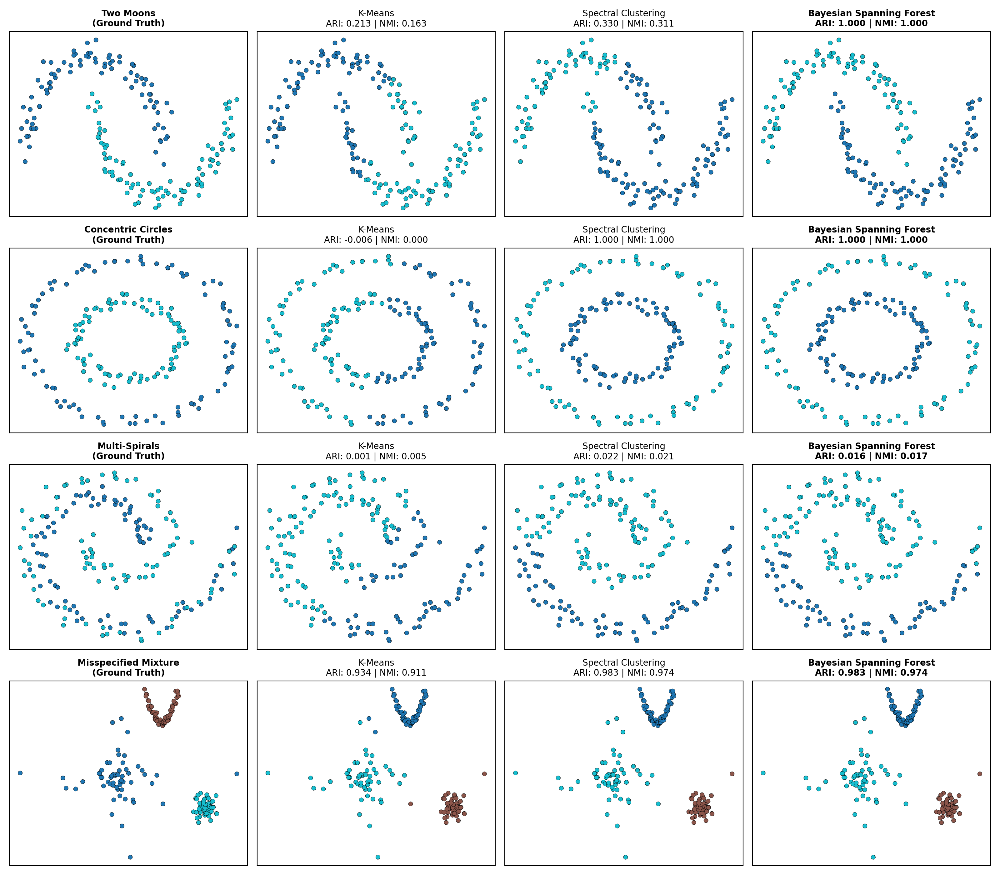

# Bayesian Geometric Forest

Graph-based Bayesian clustering, uncertainty summaries, feature-dependence trees, and weighted spanning-tree sampling for Python.

[Documentation](https://numberingeometry.github.io/bayesian-geometric-forest/) · [Interactive methods explorer](https://numberingeometry.github.io/bayesian-geometric-forest/figs/central_visualizer.html) · [Source code](https://github.com/numberingeometry/bayesian-geometric-forest)



## What is here

`bgforest` is built around weighted similarity graphs. The primary `BayesianSpanningForest` estimator combines a Forest Process prior, Matrix-Tree partition terms, and a fixed-`K` Gibbs sampler to produce a partition and posterior co-clustering matrix.

| Component | Use it for |
| --- | --- |
| `BayesianSpanningForest` | Fixed-`K` graph clustering with posterior co-clustering probabilities. |
| `ConstrainedBayesianSpanningForest` | The same model with must-link and cannot-link constraints enforced during sampling. |
| `BayesianSpanningTree` | A feature-dependence backbone and weighted spanning-tree inclusion frequencies. |
| `WilsonLERWSampler` | Exact weighted spanning-tree or rooted-forest sampling on a valid graph. |
| `BayesianDistanceClustering` | An experimental distance-only clustering prototype. |

The interactive explorer is self-contained: its figures and chart runtime are embedded, so it works from GitHub Pages or as a downloaded HTML file.

## Quick start

```bash
python -m pip install bayesian-geometric-forest
```

```python
from bgforest import BayesianSpanningForest, BayesianSpanningTree, WilsonLERWSampler
from bgforest.datasets import make_two_moons
from bgforest.metrics import compute_clustering_metrics

X, y_true = make_two_moons(n_samples=180, noise=0.08, random_state=42)

model = BayesianSpanningForest(
    n_clusters=2,
    graph_type="knn",
    n_neighbors=8,
    n_iter=1_000,
    burn_in=300,
    random_state=42,
).fit(X)

print(compute_clustering_metrics(y_true, model.labels_))
print(model.predict_proba())                 # in-sample soft memberships

tree_model = BayesianSpanningTree(n_samples_tree=100, random_state=42).fit(X)
tree_edges = WilsonLERWSampler(42).sample_spanning_tree(tree_model.W_feature_)
```

## Explore the outputs

| Posterior uncertainty | Feature-dependence backbone |
| --- | --- |
|  |  |

The gallery and interactive views are reproducible from the numbered scripts in [`examples/`](examples/). The GitHub Pages workflow regenerates them before deployment.

## Important modeling notes

- The production BSF sampler conditions on an explicit number of clusters. When `n_clusters=None`, the estimator selects a fixed `K` with a documented normalized-Laplacian eigengap heuristic before sampling.
- k-NN graphs are connected automatically by minimum cross-component bridges by default. This avoids silent failures in the matrix-tree and spanning-tree routines.
- Pairwise constraints are checked for every constrained Gibbs state; infeasible constraint sets raise a clear error.
- `BayesianDistanceClustering` is retained as an experimental prototype and should not be treated as an implementation of every inference detail in the cited paper.

## Development

```bash
python -m pip install -e ".[dev]"
python -m ruff check bgforest tests
python -m pytest
python -m build
```

The test workflow runs on Python 3.9 and 3.12, lints the code, runs coverage, and builds a distributable package. The Pages workflow is intentionally separate.

## References

This repository is motivated by work on spectral clustering and Forest Processes (Duan & Roy, 2023), Bayesian Spanning Trees (Duan & Dunson, 2024), Bayesian Distance Clustering (Duan & Dunson, 2021), and loop-erased random-walk sampling. See [theory notes](docs/theory.md) for the mathematical background and links to the papers.

## License

MIT. See [LICENSE](LICENSE).
