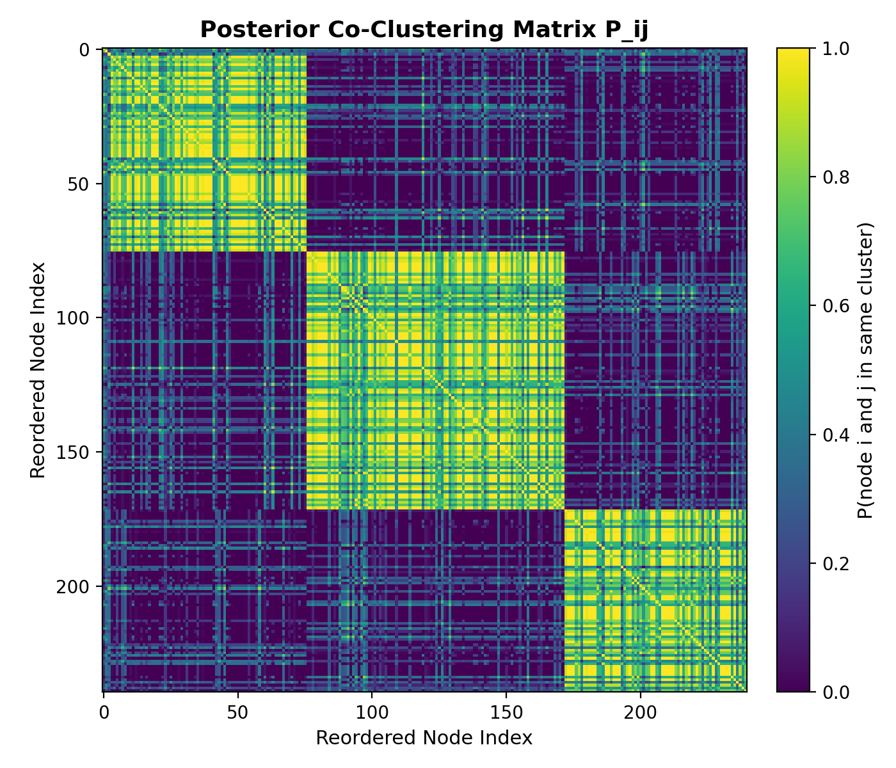
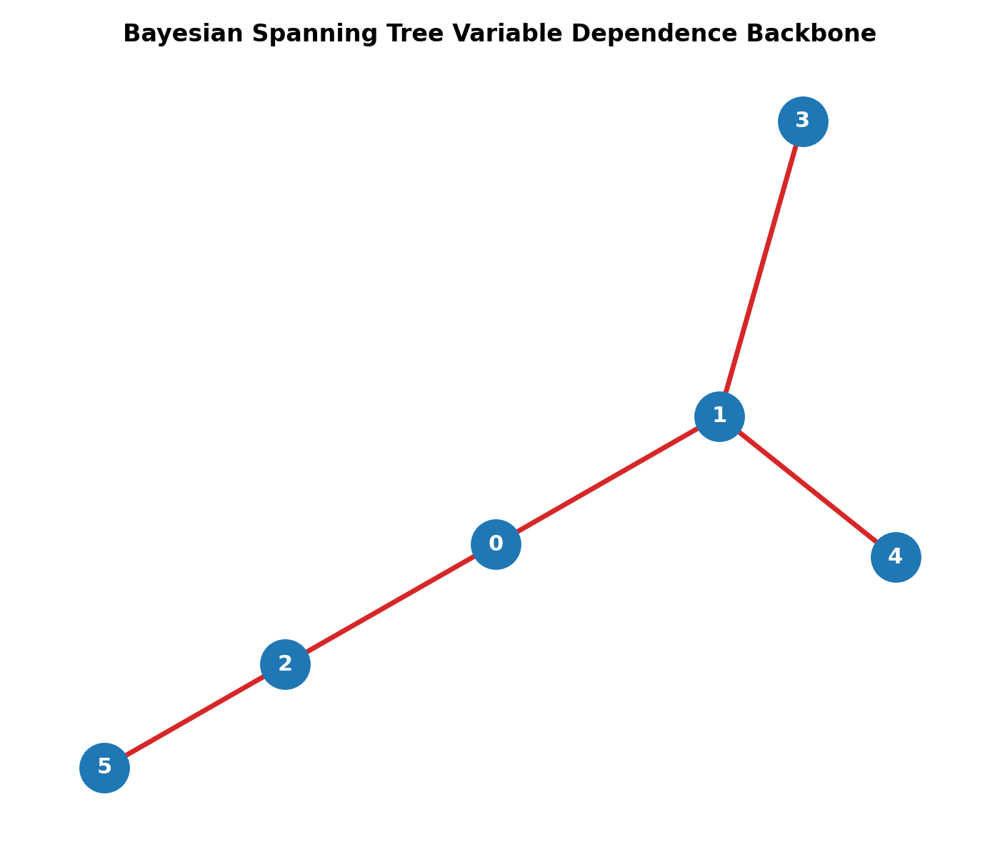

# Bayesian Geometric Forest

Bayesian Geometric Forest is a research-oriented Python package for graph-based clustering and uncertainty analysis.

[Open the interactive methods explorer](figs/central_visualizer.html){ .md-button .md-button--primary }
[View the source repository](https://github.com/numberingeometry/bayesian-geometric-forest){ .md-button }


## Start with a graph

The package builds a weighted similarity graph from observations, uses Matrix-Tree terms to score within-cluster connectivity, and exposes posterior co-clustering probabilities for a fixed number of clusters.

```python
from bgforest import BayesianSpanningForest
from bgforest.datasets import make_two_moons

X, _ = make_two_moons(n_samples=180, random_state=42)
model = BayesianSpanningForest(n_clusters=2, n_iter=1_000, random_state=42).fit(X)

labels = model.labels_
uncertainty = model.predict_proba()
```

## What to explore

| Partition uncertainty | Dependence backbone |
| --- | --- |
|  |  |

The [methods explorer](figs/central_visualizer.html) packages interactive examples into one offline-capable page: nonlinear manifolds, uncertainty in a simulated single-cell experiment, spanning-tree inclusion frequencies, and a clearly marked experimental distance-only view.

## Scope and reliability

- The main Bayesian Spanning Forest inference path uses a fixed-`K` Gibbs sampler.
- k-NN graphs are repaired to connected support by default, avoiding silent spanning-tree failures.
- Must-link and cannot-link constraints are enforced while sampling.
- The distance-only model is experimental; use the BSF path for the validated package workflow.

See [Theory & mathematics](theory.md) for the model background, or open the repository README for installation and development instructions.
